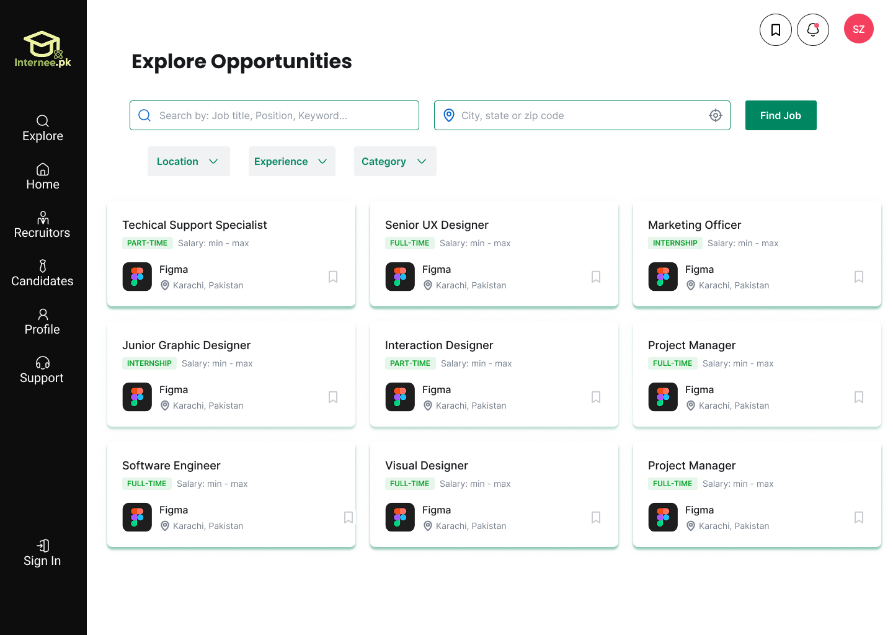
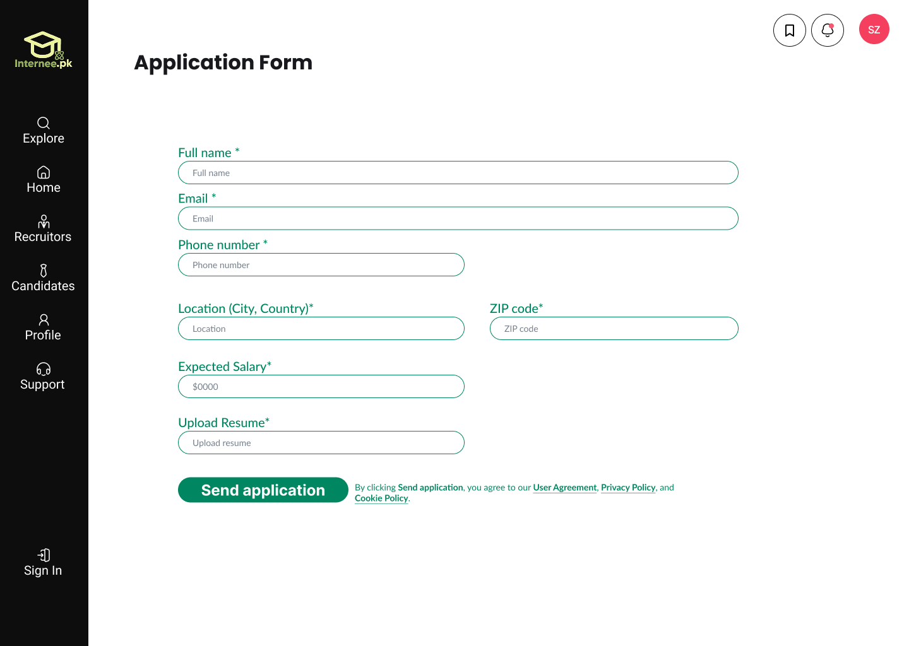
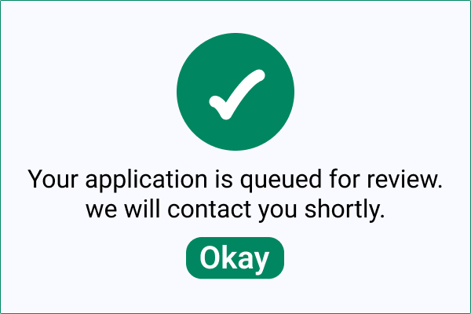
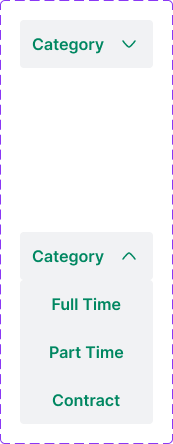
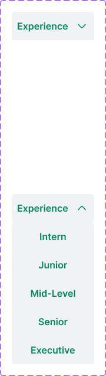

# Internee.pk-Job-Portal-UI-Revamp

UI design for a job portal including job browsing, job details, and application flow.

---

### Job Listings

### Job Details

### Application

---

## 🪟 Overlay

### Application Received

---

## 🧩 Components

### Category

### Location

### Experience

---

## 🎥 Prototype
[View Interactive Figma Prototype](https://www.figma.com/proto/VYduJCiXkiJL5FowJbN6t2/Job-Portal-Ui-Revamp?node-id=524-202&t=5F0Va4Qqb56ukEqC-1&scaling=scale-down&content-scaling=fixed&page-id=22%3A2&starting-point-node-id=504%3A520)
